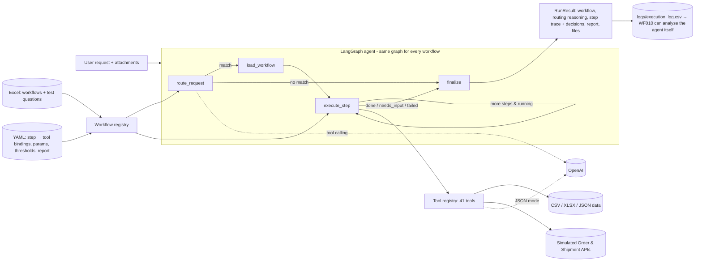

# Excel2Agent

**Turn Excel workflows into AI agents that think, act and report.**

Excel2Agent turns the business workflows written in an Excel sheet into a working AI agent. Ask in plain English
(*"Which products need restocking?"*, *"Where is order ORD-1001?"*) and it picks the right workflow, runs every
step with the right tool, applies the business rules, handles errors, and shows its work.

`Python · LangGraph · OpenAI SDK (works with Gemini) · Streamlit · Pytest`

---

## About this project (AI Agent Workflow Automation assignment)


An Excel-driven, reusable agent that turns the 10 business workflows in
[`workflows/AI_Agent_Workflow_Assessment.xlsx`](workflows/AI_Agent_Workflow_Assessment.xlsx) into executable,
explainable workflows. It understands a request, picks the right workflow, runs its steps with tools,
applies the decision rules, handles errors, and returns the result. Every run shows **which workflow was
selected, why, which steps ran (with the decisions taken), and the final output**.

> There are **no per-workflow chatbots**. One LangGraph agent, one router and one step executor run all 10 workflows.
> Workflows are *data*: the Excel file defines them, a YAML file binds each Excel step to a reusable tool.
> Adding an 11th workflow needs an Excel row and a YAML block. If the tools it needs already exist, no Python changes are needed ([proof](tests/test_extensibility.py)).

```
User request ─► Agent (LangGraph) ─► Identify workflow ─► Workflow steps ─► Tools / APIs ─► Conditions / decisions ─► Final result
                 route_request        (LLM tool calling     execute_step     tool registry    expressions, halts,      build_report
                                       or offline router)   (loop)           (41 tools)       retries, escalation
```

---

## Quick start

```bash
git clone https://github.com/harshtthakur2003-alt/Excel2Agent.git && cd Excel2Agent
python -m venv .venv && source .venv/bin/activate        # Windows: .venv\Scripts\activate
pip install -r requirements.txt
cp .env.example .env                                     # add OPENAI_API_KEY (optional, see below)

python -m agent validate                                 # Excel ↔ bindings ↔ tools consistency check
python -m agent "Which products need restocking?"        # one request
python -m agent                                          # interactive chat (supports follow-up answers)
streamlit run app.py                                     # demo UI
python scripts/run_examples.py                           # run all example requests -> outputs/
pytest -q                                                # 84 tests
```

**LLM provider.** The agent uses the OpenAI SDK, so any OpenAI-compatible provider works by setting
`OPENAI_BASE_URL`. `.env.example` is pre-filled for **Google Gemini's free tier**: get a key at
[aistudio.google.com](https://aistudio.google.com) and paste it into `OPENAI_API_KEY`. For OpenAI itself,
remove `OPENAI_BASE_URL`.

**LLM modes.** If `OPENAI_API_KEY` is set, the agent uses OpenAI (default `gpt-4o-mini`, set with `OPENAI_MODEL`)
for workflow selection (tool calling), parameter extraction, content generation, keyword intent classification
and task-skill extraction. Without a key, or with `--offline`, it runs in a **deterministic offline mode**: a lexical
router, regex extraction and grounded template/rule fallbacks. Reviewers can run everything without an API key,
and the tests are reproducible. The output always shows which mode was used.

Python 3.10+ (developed and tested on 3.13).

> The recorded results in `outputs/` were generated in offline mode. To record LLM-mode results, set
> `OPENAI_API_KEY` and run `python scripts/run_examples.py`. Each run shows `LLM mode: openai:<model>` and
> `Routing: llm-tool-calling`.

---

## The 10 workflows

| ID | Workflow | Excel test request | Result |
|---|---|---|---|
| WF001 | Inventory Restock Check | Which products need restocking? | 6 of 12 products are below minimum. Reorder quantities are rounded to the case pack |
| WF002 | Product Price Validation | Find products where vendor price differs by more than 10%. | 4 exceptions. A difference of exactly 10% is not flagged. Unmatched SKUs are listed |
| WF003 | Vendor File Processing | Process this vendor spreadsheet and show invalid rows. | Asks for the file if none is attached. Messy headers are auto-mapped. 3 invalid rows. A cleaned CSV is exported |
| WF004 | Product Description Generator | Generate SEO content for this product. | With no product attached, it asks for the product. With a product attached, it writes 4 texts, marks missing facts `[MISSING: …]` and enforces length limits |
| WF005 | Customer Order Status | Where is order ORD-1001? | Status, items and tracking. If the order isn't found, it asks for another identifier. API retries |
| WF006 | Duplicate Product Detection | Find likely duplicate products in the catalog. | Definite (exact SKU) vs High/Medium (attributes). Size/colour variants are excluded |
| WF007 | Marketing Campaign Brief | Create a campaign brief for the new collection. | Asks for goal and dates first (decision rule), then produces the full brief |
| WF008 | SEO Keyword Classification | Classify these keywords and map them to pages. | 24 → 22 unique keywords, each with intent, category, priority and target page |
| WF009 | Employee Task Assignment | Assign this urgent task to the best available developer. | Picks Aarav Mehta and explains why the others were rejected. Escalates when nobody fits |
| WF010 | Workflow Performance Report | Which workflows are failing most often? | Failure rates, averages, frequent errors, slow steps and recommendations |

Full per-workflow analysis (inputs, steps→tools, tools/APIs, conditions, expected output, and how each rule was
interpreted): **[docs/WORKFLOW_ANALYSIS.md](docs/WORKFLOW_ANALYSIS.md)**.
All example runs with full traces: **[outputs/results.md](outputs/results.md)** (and per workflow in
[`outputs/by_workflow/`](outputs/by_workflow)).

### Example output (CLI, abridged)

```
╭──────────────── Which products need restocking? ────────────────╮
│ Selected workflow: WF001  Inventory Restock Check                │
│ Routing: offline-lexical · confidence 0.85                       │
│ Status: COMPLETED                                                │
╰──────────────────────────────────────────────────────────────────╯
 # │ Step (from Excel)                             │ Tool            │ Result / decisions
 1 │ Load inventory                                │ load_table      │ Loaded 12 rows from inventory.csv
 2 │ Compare current stock with minimum threshold  │ compute_columns │ threshold = override or minimum_stock
 3 │ Identify low-stock products                   │ filter_rows     │ Rule `current_stock < threshold` -> 6 products
 4 │ Calculate reorder quantity                    │ compute_columns │ (threshold x 2) - stock, rounded to case pack
 5 │ Generate restock list                         │ filter_rows     │ 6 restock lines
Result: 6 of 12 products are below their minimum stock threshold and need restocking.
 SKU-1001 Merino Wool Crew Sweater  stock 4  threshold 20  reorder 36 ...
```

---

## Architecture



| Layer | File | Responsibility |
|---|---|---|
| Workflow source | `workflows/*.xlsx` | Business definition: name, trigger, inputs, **ordered steps**, decision logic, tools, expected output, test questions |
| Execution binding | `config/workflow_bindings.yaml` | For each Excel step: tool + args, plus request parameters, thresholds and the report layout |
| Registry | `agent/registry.py` | Parses the Excel file, merges bindings and **cross-validates** them: step counts match, tools exist |
| Router | `agent/router.py` | Picks the workflow and extracts parameters. Each workflow is generated as one OpenAI function, built from the Excel and YAML. Offline TF-IDF fallback |
| Orchestration | `agent/graph.py` | LangGraph `route → load → execute_step (loop) → finalize`. Holds follow-up memory |
| Executor | `agent/executor.py` | Generic step runner: `$ref` resolution, `when` conditions, retries, `on_error`, halts |
| Tools | `agent/tools/*.py` | `@register_tool` functions, auto-discovered: generic data/calculator/decision tools, LLM tools, domain tools |
| Decision rules | `agent/expressions.py` | Sandboxed expression evaluator for rules like `abs(pct_difference) > tolerance` |
| LLM | `agent/llm.py` | OpenAI wrapper (tool calling + JSON mode, retries). Reports offline mode when no key is set |
| Simulated APIs | `agent/services/mock_apis.py` | Order and shipment APIs with latency, not-found responses and injectable outages |
| Presentation | `agent/render.py`, `app.py`, `agent/__main__.py` | Rich CLI, Markdown and the Streamlit UI. All render the same `RunResult` |

Design rationale and trade-offs: **[docs/ARCHITECTURE.md](docs/ARCHITECTURE.md)**.

### How a request is processed

1. **Identify workflow.** The router sends the request to OpenAI with the 10 workflow functions plus
   `no_matching_workflow`, using `tool_choice="required"`. The model returns the workflow, its parameters,
   a confidence score and one sentence of reasoning. The prompt forbids inventing values, so missing inputs stay
   missing and the workflow asks for them. Parameter precedence: defaults < earlier follow-up answers < regex <
   LLM < attachments.
2. **Execute steps.** `execute_step` runs once per Excel step, in Excel order. Each step's tool receives
   resolved args (`$params.x`, `$data.previous_output`, `$settings.threshold`) and returns an output plus the
   human-readable *decisions* it took.
3. **Conditions and decisions.** Decision logic is expressed as data, such as `current_stock < threshold`,
   `abs(pct_difference) > tolerance` or `skill_match >= 0.67 and has_capacity`. A step can also **halt** the
   workflow:
   - `needs_input`: missing goal or dates, unknown order, no product name. The agent asks a question and
     remembers the pending workflow, so the next message continues it.
   - `escalated`: no suitable employee.
4. **Errors.** Every step has a policy. Transient errors are retried (`retries: 2` on the order API), a failed
   step either stops the workflow with a clear message (`on_error: fail`) or is skipped (`continue`), and
   optional dependencies degrade gracefully (shipment API down → "tracking unavailable"). LLM failures fall back
   to deterministic templates, and LLM output is length-validated, re-asked once, then trimmed.
5. **Final result.** A declarative `report` spec (summary, metrics, tables, sections, CSV exports) is rendered
   identically in the CLI, the UI and Markdown.

### Status values

`completed` · `needs_input` (the agent asked a question) · `escalated` (decision rule required a human) ·
`failed` (error explained) · `no_match` (out-of-scope request; the available workflows are listed)

---

## Adding an 11th workflow

1. Add a row to the **Workflows** sheet. Steps are separated by `→`.
2. Add a block under `workflows:` in `config/workflow_bindings.yaml`, with one tool per Excel step (in order),
   plus parameters, thresholds and the report.
3. *Only if a capability is genuinely new:* write one `@register_tool("name")` function in `agent/tools/`.
   It is auto-discovered.
4. Run `python -m agent validate`.

The router (LLM function list and offline index), the graph, the executor, the CLI and the UI pick the new
workflow up automatically. Try it: `python scripts/demo_add_workflow.py` adds a *Category Stock Summary* workflow
on temporary copies and runs it. `tests/test_extensibility.py` asserts the same.
Guide: **[docs/ADDING_A_WORKFLOW.md](docs/ADDING_A_WORKFLOW.md)**.

---

## CLI reference

```bash
python -m agent "Where is order ORD-1001?"
python -m agent "Generate SEO content for this product." --attach examples/attachments/product_wool_coat.json
python -m agent "Generate SEO content. name: Silk Scarf; category: Accessories; colour: emerald"   # facts inline
python -m agent "Process this vendor spreadsheet and show invalid rows." --attach data/vendor_files/vendor_acme_products.xlsx
python -m agent "Which workflows are failing most often?" --json     # machine-readable RunResult
python -m agent list | validate | tools | graph                      # inspect workflows, tools, LangGraph (Mermaid)
SIMULATE_API_FAILURE=order_api:2 python -m agent "Where is order ORD-1003?"   # see retries
python -m agent --offline                                             # interactive, no LLM
```

In interactive mode, use `:attach <file>` to attach data and `:reset` to clear the pending follow-up.

## Repository layout

```
workflows/AI_Agent_Workflow_Assessment.xlsx  workflow source (unchanged original)
config/workflow_bindings.yaml                 step→tool bindings, params, thresholds, report specs
agent/                                        registry, router, LangGraph agent, executor, tools, LLM, rendering
data/                                         simulated business data (inventory, prices, vendor files, orders, catalog, ...)
examples/requests.yaml                        29 example cases, 32 turns (all 10 Excel test questions + edge cases)
examples/attachments/                         sample product JSON attachments
examples/wf011_extension/                     YAML snippet for the 11th-workflow demo
outputs/results.md | results.json             recorded results of every example run
outputs/by_workflow/WF0xx.md                  results grouped per workflow
outputs/files/                                files produced by workflows (restock list, cleaned vendor file, ...)
scripts/                                      run_examples, generate_sample_data, generate_workflow_docs, demo_add_workflow
tests/                                        84 pytest tests (registry, routing, workflows, errors, edge cases, OpenAI path, extensibility)
docs/                                         ARCHITECTURE.md, WORKFLOW_ANALYSIS.md, ADDING_A_WORKFLOW.md, LOOM_SCRIPT.md
app.py                                        Streamlit UI
```

## Testing

`pytest -q` runs 84 tests offline in about 15 seconds:

- **Registry:** all 10 workflows load from Excel; every Excel step is bound in order to an existing tool; missing
  bindings and unknown tools are reported.
- **Routing:** all 10 Excel test questions plus 10 paraphrases route correctly; out-of-scope requests are rejected;
  parameters are extracted.
- **Workflows:** every case in `examples/requests.yaml`, plus business-rule assertions. These include the 10%
  boundary, stock equal to minimum, the case-pack rounding, variants not counted as duplicates, the follow-up with
  a new identifier, and escalation.
- **Error handling and edge cases:** retries, persistent outages, graceful degradation, missing files and logs,
  `on_error`, `when`, the sandboxed expression evaluator, blank values, ID normalisation, role synonyms, and LLM
  misbehaviour (non-numeric confidence, incomplete JSON).
- **OpenAI path:** runs the real `openai` SDK against a mocked HTTP transport. It checks tool-calling routing,
  JSON generation, the validation-and-retry loop, and the fallback when the API fails.
- **Extensibility:** WF011 is added through Excel and YAML only.

`python scripts/run_examples.py` checks the expected status of all 32 example runs and regenerates `outputs/`.

## Assumptions

- Real systems are unavailable, so data lives in `data/` (generated by `scripts/generate_sample_data.py`, seed 42).
  The order and shipment APIs are simulated with latency and injectable failures.
- "Exceeds 10%" is treated as strictly greater than 10%, and "current_stock < minimum_stock" as strictly less.
  Boundary rows are included in the data to show this.
- Reorder quantity is not specified in the Excel file. It is calculated as 2 × threshold − current stock, rounded
  up to the supplier case pack. This is configurable.
- WF004: product name and category are required (the agent asks for them). The other attributes are optional and
  are marked as missing rather than guessed.
- WF003: the vendor file must be attached (`--attach`, the UI uploader, or a path in the request). Without one, the
  agent asks for it rather than processing a sample.
- WF009: "this urgent task" with no description resolves to the single open, unassigned urgent task in the task DB.
  If several match, the agent asks which one.
- WF010: thresholds are failure rate > 10%, average run time > 8 s, and average step time > 3 s (configurable).
